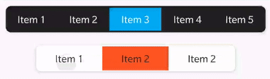
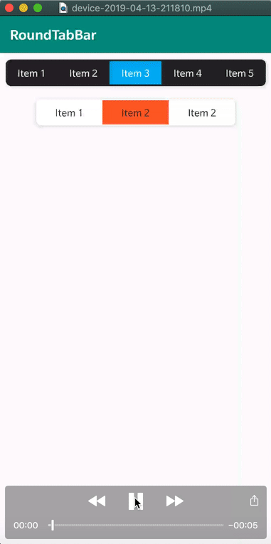

# RoundTabBar

圆角且切换柔和的TabBar

## Add dependency
### **Step 1.** Add the JitPack repository to your build file
### Add it in your root build.gradle at the end of repositories:   

```gradle
allprojects {
		repositories {
			...
			maven { url 'https://jitpack.io' }
		}
	}
```

### **Step 2.** Add the dependency
```gradle
dependencies {
  implementation 'com.github.csming1995:RoundTabBar:1.0.0-beta1'
}
```

### **Step 3.** Usage

**Layout:**

```xml
<?xml version="1.0" encoding="utf-8"?>
<LinearLayout xmlns:android="http://schemas.android.com/apk/res/android"
    xmlns:app="http://schemas.android.com/apk/res-auto"
    xmlns:tools="http://schemas.android.com/tools"
    android:layout_width="match_parent"
    android:layout_height="match_parent"
    android:orientation="vertical"
    tools:context=".MainActivity">

    <com.csming.roundtab.RoundTabBar
        android:id="@+id/round_tabbar"
        android:layout_width="match_parent"
        android:layout_height="40dp"
        android:layout_margin="10dp"
        app:round_tab_bar_background="#212121"
        app:round_tab_bar_border_width="3dp"
        app:round_tab_bar_elevation="4dp"
        app:round_tab_bar_radius="8dp"
        app:round_tab_bar_text_color="#ffffff" />

    <com.csming.roundtab.RoundTabBar
        android:id="@+id/round_tabbar2"
        android:layout_width="300dp"
        android:layout_height="40dp"
        android:layout_gravity="center"
        android:layout_margin="10dp"
        app:round_tab_bar_background="#ffffff"
        app:round_tab_bar_border_width="2dp"
        app:round_tab_bar_elevation="4dp"
        app:round_tab_bar_radius="8dp"
        app:round_tab_bar_text_color="#212121" />

</LinearLayout>
```

**Activity:**

```java
public class MainActivity extends AppCompatActivity {

    private static final int ID_1 = 1;
    private static final int ID_2 = 2;
    private static final int ID_3 = 3;
    private static final int ID_4 = 4;
    private static final int ID_5 = 5;

    private RoundTabBar mRoundTabBar;
    private RoundTabBar mRoundTabBar2;

    @Override
    protected void onCreate(Bundle savedInstanceState) {
        super.onCreate(savedInstanceState);
        setContentView(R.layout.activity_main);

        mRoundTabBar = findViewById(R.id.round_tabbar);
        mRoundTabBar.add(new RoundTabBar.Item(ID_1, R.color.test1, "Item 1"));
        mRoundTabBar.add(new RoundTabBar.Item(ID_2, R.color.test2, "Item 2"));
        mRoundTabBar.add(new RoundTabBar.Item(ID_3, R.color.test3, "Item 3"));
        mRoundTabBar.add(new RoundTabBar.Item(ID_4, R.color.test4, "Item 4"));
        mRoundTabBar.add(new RoundTabBar.Item(ID_5, R.color.test5, "Item 5"));

        mRoundTabBar.setSelectedItem(2);

        mRoundTabBar2 = findViewById(R.id.round_tabbar2);
        mRoundTabBar2.add(new RoundTabBar.Item(ID_1, R.color.test6, "Item 1", R.color.color_black));
        mRoundTabBar2.add(new RoundTabBar.Item(ID_2, R.color.test6, "Item 2", R.color.color_black));
        mRoundTabBar2.add(new RoundTabBar.Item(ID_2, R.color.test6, "Item 2", R.color.color_black));

        mRoundTabBar2.setSelectedItem(0);
    }
}
```

## 效果展示




